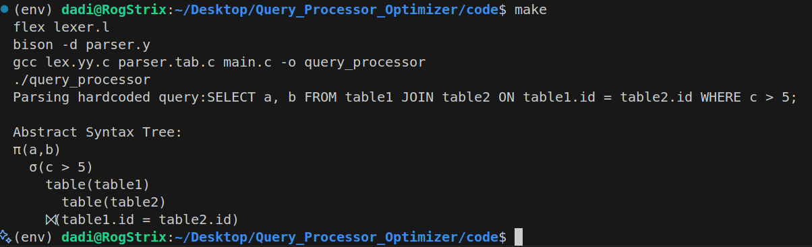

# Query Processor Optimizer

## Stage 1: Query Parsing and Abstract Syntax Tree Generation

In this stage, the query processor parses a hardcoded SQL query and generates its Abstract Syntax Tree (AST).

### Hardcoded Query:
```sql
SELECT a, b 
FROM table1 
JOIN table2 ON table1.id = table2.id 
WHERE c > 5;
```

### Abstract Syntax Tree:
```
π(a,b)
    σ(c > 5)
        table(table1)
            table(table2)
        ⨝(table1.id = table2.id)
```

### Output:
The generated AST is visualized in the image below:

