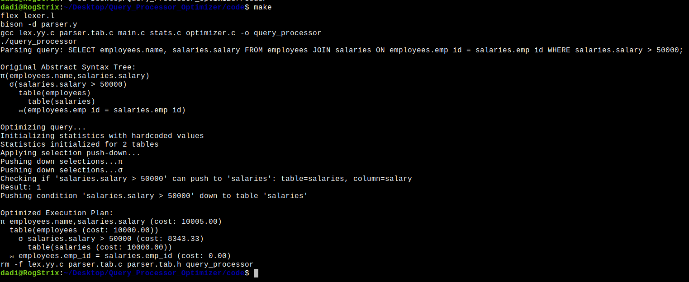

# Query Processor Optimizer

### Stage 1: Query Parsing & AST Generation
- Parses hardcoded SQL `SELECT-FROM-JOIN-WHERE` queries.
- Constructs an **Abstract Syntax Tree (AST)** to represent the logical structure of the query.
- AST is displayed in a readable tree format for analysis and debugging.

### Stage 2: Query Optimization - **Selection Push-Down**
- Optimizes query by pushing down selections closer to base tables.
- Reduces intermediate result sizes and improves query performance.
- Cost estimation for each operator is shown after optimization.


### 🔍 Input Query
```sql
SELECT employees.name, salaries.salary 
FROM employees 
JOIN salaries ON employees.emp_id = salaries.emp_id 
WHERE salaries.salary > 50000;
```

### Original AST
```
π(employees.name,salaries.salary)
    σ(salaries.salary > 50000)
        table(employees)
            table(salaries)
        ⨝(employees.emp_id = salaries.emp_id)
```

### Optimized Execution Plan
```
π employees.name,salaries.salary (cost: 10005.00)
    table(employees (cost: 10000.00))
        σ salaries.salary > 50000 (cost: 8343.33)
            table(salaries (cost: 10000.00))
    ⨝ employees.emp_id = salaries.emp_id (cost: 0.00)
```



---

## 🛠️ Build and Run

1. **Compile the Project**
     ```bash
     flex lexer.l
     bison -d parser.y
     gcc lex.yy.c parser.tab.c main.c stats.c optimizer.c -o query_processor
     ```

2. **Run the Query Processor**
     ```bash
     ./query_processor
     ```

3. **Clean Build Files**
     ```bash
     rm -f lex.yy.c parser.tab.c parser.tab.h query_processor
     ```

---

## 📦 Project Structure

```
├── lexer.l           # Flex specification for lexical analysis
├── parser.y          # Bison grammar for SQL parsing
├── main.c            # Driver program
├── stats.c           # Handles statistics and cost estimation
├── optimizer.c       # Query optimization logic (Selection push-down)
├── ast.h/.c          # AST structure and visualization utilities
├── stage1_output.png # Sample AST visualization
├── stage2_output.png # Sample optimized execution plan visualization
└── README.md         # This file
```

---

## 🔮 Coming Soon
- **Stage 3**: Query Optimization - Join Reordering
  - Implementing both Greedy and Cost-based join reordering strategies.
  - Cost estimation for join operations.
  - Visualization of the optimized query plan.
- Join Reordering (Greedy & Cost-based)
- Query plan visualization (graphical output)

---

## 📜 License

This project is released under the MIT License.

